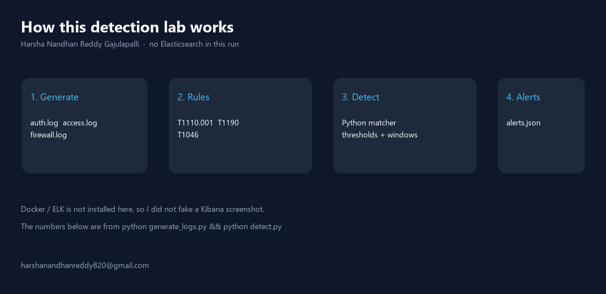
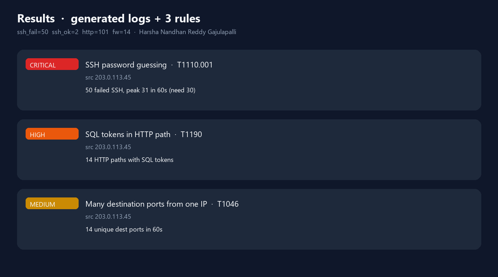

# SIEM Detection Lab

Detection rules on **generated** auth, Apache, and iptables logs.

This is **not** a live Elasticsearch cluster. Docker is not installed on the machine that produced the results below, so there is no Kibana screenshot. The proof is `python generate_logs.py` then `python detect.py`.

Author: **Harsha Nandhan Reddy Gajulapalli**  
Email: **harshanandhanreddy820@gmail.com**



## Rules

| ID | MITRE | Logic |
|---|---|---|
| `brute_force_ssh` | T1110.001 | ≥ 30 failed SSH passwords from one IP in 60 seconds |
| `sql_injection` | T1190 | ≥ 5 HTTP paths containing SQL tokens (`union`, `select`, `drop`, …) |
| `port_scan` | T1046 | ≥ 10 unique destination ports from one IP in 60 seconds |

Successful SSH from `10.0.0.20` is in the same `auth.log` and **does not** fire the brute-force rule.

## Run

```bash
python generate_logs.py
python detect.py
python render_images.py
```

Stdlib only for generate/detect. Pillow is only for the PNGs.

## Results

From a local run (seed 42). Attacker IP in the generated data: `203.0.113.45` (TEST-NET-3, RFC 5737 — not a real host).

| Log file | Lines |
|---|---:|
| `auth.log` failed SSH | 50 |
| `auth.log` accepted SSH | 2 |
| `access.log` HTTP | 101 |
| `firewall.log` SYN | 14 |



| Severity | Rule | What matched |
|---|---|---|
| critical | brute_force_ssh | 50 failures, **peak 31 in 60s** (threshold 30) |
| high | sql_injection | **14** paths with SQL tokens |
| medium | port_scan | **14** unique dest ports in 60s |

JSON: `results/alerts.json`

Seven of the generated “SQLi” URLs were `' OR '1'='1'` with **no** SQL keyword. This rule correctly ignored them.

## Layout

```
generate_logs.py     writes results/logs/
detect.py            reads logs + rules/, writes alerts.json
rules/               three JSON rules
results/logs/        auth.log, access.log, firewall.log
results/alerts.json  this run
images/              diagrams from that JSON
```

## License

MIT. Copyright (c) 2026 Harsha Nandhan Reddy Gajulapalli.
